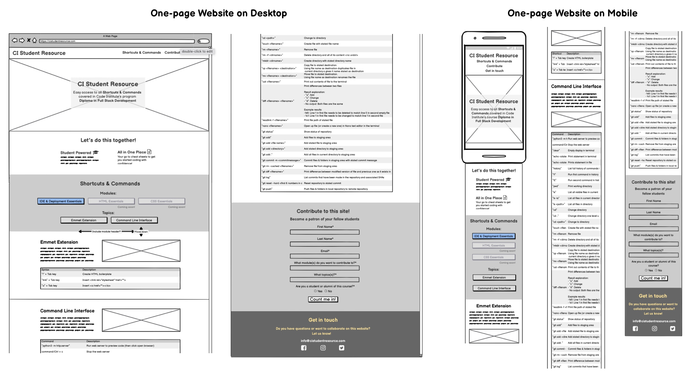

# CI Student Resource

The CI Student Resource website is a student-powered one-page website targeted towards Code Institute students looking for an easy overview of useful content covered in the program Diploma in Full Stack Development. The content of the website is intended to be a go to reference to use while learning the essentials of coding. 

This first iteration of the website focuses on **Shortcuts & Commands** in the IDE and Deployment Essentials module while leaving hints for future content inclusions. This is done through the disabled module navigation buttons in the mid-page Topics navigation section with a *Coming soon!* text added for clarity.  

CI Student Resource is also intended to engage other students as content providers through the **Contribute to this website** form and as collaborators in the *Get in touch* footer.

The **3 main objectives** of this website can be summarized as followed:
1. Serve useful course content in a user-friendly, structured and compact format
2. Attract fellow students and alumni as content providers of the website
3. Attract fellow students and alumni as collaborators of the website

### [Here's a live link to the website](https://loellarp.github.io/ci-student-resource/index.html)

## UX

### Wireframes

I used Balsamiq Wireframes to create the wireframes.

### Surface

#### Colors

The main colors used in this project:
- Background colors: #D3D3D3, #acc2e4, #e6e6e6
- Font colors: #212324, #2c2f30, #acc5eb, white
- Form input borders on hover: #3373d3
- Sign up button backgrounds: #3373d3, #212324 (on hover)
- Signup button borders: #3373d3 (on hover)

### Fonts

- The main fonts used in this project was Roboto and Archivo with sans-serif as backup font

### Images & Video Snippets

- I used an image from [Unsplash.com](https://unsplash.com/) as a hero image which is credited in the credit section
- The video snippets I created myself and the tools used for this are credited in the credit section

## Features

### Existing Features

#### Top Navigation
- Featured at the top of the page is the header with the logo and a responsive navigation bar that floats to the left on wider screens and stacks below the header on smaller screens. The navigation bar links to the sections Shortcuts & Commands, Contribute and Get in touch, focusing on the 3 main objectives of the website.

- Top Navigation - Desktop:
  
  
- Top Navigation - Mobile:

  

#### Landing-Page Image & Text Overlay
- The landing page introduces users to the website through an image and a text overlay that communicates the main user objective and tone of the website

- Landing Page Image & Text Overlay - Desktop:

  

- Landing Page Image & Text Overlay - Mobile:

  

#### About Section
- The about sections includes further information about the value of CI Student Resource with an inciting tagline of “Let’s do this together”, and focusing on the website being Student-Powered and keeping All in One Place

- About Section - Website:

  

- About Section - Mobile:

  

#### Mid-page Content Navigation
- The mid-page content navigation section gives the user an overview of the content of the website as well an indications of the coming growth of the website with content coming soon
- The mid-page content navigation section is divided in Modules and Topics with only one module being available at the moment. Topic boxes include navigation links that takes the users to the relevant sections of the page

- Mid-page Content Navigation - Desktop:
    
  

- Mid-page Content Navigation - Mobile: 

  

#### Module Content Header
- The Module Content Header introduces the users to topic content following the Module Content Header

- Module Content Header - Desktop:

   

- Module Content Header - Mobile

  

#### Emmet Extension Content Section
- The first topic of this website is for the Emmet Extension and includes one short introduction text, a looping and muted video snippet of the tool in use as well a table with the syntax explored in the module and their associated description.

- Emmet Extension Content Section - Desktop:

   

- Emmet Extension Content Section - Mobile:

  

#### Command Line Interface Content Section
- The content of the Command Line Interface Content Section includes the same content structure as the one for the Emmet Extension, with a text introduction, a video snippet and a table with commands and descriptions

- Command Line Interface Content Section - Desktop:

   

- Command Line Interface Content Section - Mobile:

  

#### Contribute Sign Up
- This section entourages users to contribute to the website with a sign up form where the user can specify what module(s) and topic(s) they want to contribute. The form also includes a input field for the user to specify if the are/have been a student of the focus program of this website, Code Institute’s Diploma in Full Stack Development
- All fields are required to submit the form and the email input must be of a valid format
- The form input data is not linked to any destination in this iteration of the website so a Method attribute has not been specified 

- Contribute Section - Desktop:

   

- Contribute Section - Mobile:

  

#### Get in touch Section
- This section encourages User Collaboration and to get in touch users have questions
- An Email Address has been included without mailto tags to avoid the that user computers opens up local email agents when clicked
- Social Media Icons & Links have been included at the end of the Get in Touch Section and all opens up in a new tab

- Get in Touch Section - Desktop:

   

- Get in Touch Section - Mobile:

  

#### Features Left to Implement for Future Iterations
- Full Lecture Overview (category tree) as an expanding Module tree down to lecture level. 
- Expanded content formats sorted by module and topic. This could include Lecture Slides, Formatted Transcripts, CI Recommended Resources, and Student Recommended Resources for each section.
- Expanding burger menu on mobile screens
- Improved design of overlaying text on landing page image

## Testing

- CI Student Resource has been tested to work on the Chrome, Firefox, Safari and Edge browsers on desktop as well as the Safari and Chrome browsers on iOS mobile.  
- I have used Chrome DevTools to confirm that the website and layout is responsive and functions as it should on all common and standard screen sizes.
- I have tested if all external and internal links are linked correctly and behave as expected in all tested browsers and on both desktop and mobile.
- I texted the behavior of form in all browsers and on both desktop and mobile to confirm that all fields are required and only accept a valid email address in the email input field.
- I have also tested CI Student Resourse through three external Validations Tools:
  - The [W3C Markup Validation Service](https://validator.w3.org/) checked the validation of the html code and returned one error and a warning related to a duplicate ID in the code:
   - 
  - After removing the duplicate ID from the code and re-running validation, no issues were found:
   - 
  - The [W3C CSS Validation Service](https://jigsaw.w3.org/css-validator/) checked the validation of the CSS code and returned two parse errors: 
   - 
  - After fixing these two issues in the code and re-running no errors were returned:
   - 
  - [Lighthouse in DevTools](https://developers.google.com/web/tools/lighthouse) an tests on the website for both desktop and mobile and scored them on a scale 1-100 in the categories Performance, Accessibility, Best Practices and SEO and returned good results for the latter three categories but scored at a 78 on Performance on mobile:
   - 
    This was reported to partly be caused by the use of file in git-format of the website:
   -  
   - After reformatting the video content and switching the gifs out for webm and mp4 the loading of the videos were greatly improved but did only more the performance score up to 80:
   - 

### Unresolved bugs
   - During testing of the website on desktop I found an issue with the navigation links not behaving as expected. After clicking a first navigation link and then scrolling back up to the navigation and clicking a second navigation link, the user is not taken to the intended section. The page instead flickers and lands in the wrong area. Clicking the same link again returns the expected behavior and takes the user t the correct location of the page. No solution to this bug has been found so this issue has been left unresolved. 

## Deployment
   - CI Student Resource website was deployed on GitHub pages following the steps below:
     - In the GitHub repository for the project, locate and click on Settings
     - In the left navigation bar, locate and click on Pages
     - Under Sourse, change Branch to Main and click Save
     - This will load a message above the Source, letting you know when the website has been published including a link your your website on Pages

## [Here's a live link to the website](https://loellarp.github.io/ci-student-resource/index.html)

## Credits

- Wireframes
  - Initial wireframes of the website design on desktop and mobile were created with Balsamic
- Text content
  - All content in the topic tables used on the website has been collected from Lecture Slides and Lecture Transcripts from [Code Institute’s](https://codeinstitute.net/se/) program Diploma in Full Stack Software Development
  - Information for the topic introduction text has been collected from the same Lecture Slides and Lecture Transcripts as well as from wikipedia and the official website of the [Emmet Extension](https://emmet.io/) 
- The image used as a Landing Page Image was was taken from this [link on the Unsplash[(https://unsplash.com/photos/IgUR1iX0mqM)] Website and is free to use under the Unsplash License
- The image used as a Landing Page Image was was taken from this link on the Unsplash Website and is free to use under the Unsplash License
- Icons used on CI Student Resource has been taken from the free library at [Font Awesome](https://fontawesome.com/icons)
- The fonts Archivo and Roboto use on this website has been taken from [Google Fonts](https://fonts.google.com/)
- Videos 
 - Videos were captured with screen recording using Quicktime for Mac, while demonstrating the tools on screen in the text editor and bash editor on Gitpod
 - [Creative Cloud Express](https://www.adobe.com/express/) was used for cropping and resizing videos
 - [Cloudconvert](https://cloudconvert.com/) was used to convert videos from mp4-format to webm-format

## Code
- Header
  - The HTML structure and part of the css solution was taken from [Love Running](https://loellarp.github.io/love-running/index.html#) while the solution for positioning the floats was taken from [this article](http://nambiara.blogspot.com/2010/10/float-right-without-changing-order.html)
- Landing Page Image & Text Overlay
  - Parts of this solution was taken from Love Running while code on positioning was found in [this W3 tutorial]
- About Section
  - Part of this solution was taken from Love Running while part from [w3 tutorials](https://www.w3schools.com/cssref/pr_class_float.asp) and examples on uses of float
- Content Navigation Section
  - This section was built on the basics of Responsive CSS & Flexbox in Udemy’s course The Web Developer Bootcamp and this [Stack Overflow link](https://stackoverflow.com/questions/20626685/better-way-to-set-distance-between-flexbox-items)
- The white right side margin initially appearing in responsive mobile view in DevTools was removed through this [Stack Overflow link](https://stackoverflow.com/questions/4617872/white-space-showing-up-on-right-side-of-page-when-background-image-should-extend)
- Embedded video content
  - The code for mimicking gif behavior on mp4 and webM with loop, autoplay, muted and playsinline was taken from [this link](https://web.dev/efficient-animated-content/) 
- Tables
  - Styling syntax was found in these [W3 tutorials](https://www.w3schools.com/css/css_table.asp)
  - The hyphens syntax was found in [this link](https://css-tricks.com/almanac/properties/h/hyphenate/)
  - The syntax on colgroup for adjusting column with was found in these [W3 tutorials] https://www.w3schools.com/tags/tag_colgroup.asp
Form
  - Part of the solution for wrapping and positioning the form as well as adjusting background color and opacity was taken from Love Running 
  - The syntax for text-indent was [found here](https://developer.mozilla.org/en-US/docs/Web/CSS/text-indent)
  - The syntax for the :hover selector was found on [W3schools](https://developer.mozilla.org/en-US/docs/Web/CSS/text-indent)
Social Media Icons
  - Code for this section was taken from Love Running
